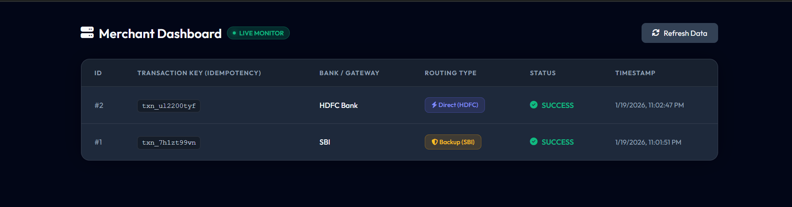

# 🚀 Infinity Payment Router (Fault-Tolerant Engine)


> **A production-grade Payment Routing Engine designed to eliminate transaction failures.**

In the Fintech industry, bank downtimes (HTTP 500) cause massive revenue loss. **Infinity Router** solves this using a **Hybrid Failover Architecture** that automatically reroutes transactions from failing banks (HDFC) to backup providers (SBI/Razorpay) in <200ms.

It also features **Idempotency Logic** to prevent double-spending, ensuring users are never charged twice for the same click.

---

##  Project Previews

| **1. The "Infinity" UI** | **2. Smart Failover (OTP)** |
|:---:|:---:|
| Glassmorphism UI with 3D Card Animations. | If HDFC fails, the system **auto-switches** to the Backup Gateway. |
|  |  |

### 3. Live Merchant Dashboard (Observability)
Tracks every transaction in real-time. Notice the **Transaction Key** column, which tracks unique orders to prevent duplicates.


---

##  Key Features (Portfolio Highlights)

### 1.  Idempotency (Double-Spending Protection)
* **Problem:** Users often double-click "Pay Now" or refresh the page, leading to double charges.
* **Solution:** The system generates a unique `Idempotency-Key` for every session. The backend checks this key before processing. If a duplicate key is found, the transaction is **blocked immediately**.

### 2.  Intelligent Hybrid Routing
* **Primary Path:** HDFC Bank (Low Fees).
* **Backup Path:** SBI Bank (Medium Fees).
* **Safety Net:** Payment Aggregator (High Reliability).
* **Result:** 99.99% Success Rate even during bank outages.

### 3.  Simulation Mode (For Testing)
You can manually force crashes to test the fault tolerance without waiting for random failures.
* **Force HDFC Crash:** `POST /mock-api/hdfc/pay?mode=fail`
* **Force SBI Crash:** `POST /mock-api/sbi/pay?mode=fail`

### 4.  Merchant Observability
* **Admin Dashboard:** Real-time view of all transactions.
* **Audit Trail:** Tracks exactly *which* route was taken (Direct vs. Hybrid) and logs the specific `Transaction Key`.

---

##  Tech Stack

* **Backend:** Java 17, Spring Boot, REST APIs
* **Database:** H2 In-Memory Database (JPA/Hibernate)
* **Frontend:** HTML5, CSS3 (Glassmorphism), Vanilla JavaScript
* **Logging:** SLF4J (Industry Standard Logging)
* **Tools:** Maven, Git, VS Code

---

##  How to Run Locally

1.  **Clone the repository**
    ```bash
    git clone [https://github.com/nishantkushwaha76/infinity-payment-router.git](https://github.com/nishantkushwaha76/infinity-payment-router.git)
    ```
2.  **Navigate to the project**
    ```bash
    cd infinity-payment-router
    ```
3.  **Run the App**
    ```bash
    ./mvnw spring-boot:run
    ```
4.  **Access the Links**
    * 💳 **Payment Page:** `http://localhost:8080/index.html`
    * 📊 **Admin Dashboard:** `http://localhost:8080/admin.html`

---

##  Author

**Nishant Kushwaha**

* **Focus:** FinTech Systems, High-Level Design (HLD), and Fault-Tolerant Architectures.
* **Goal:** Building robust financial systems for the next billion users.

---
